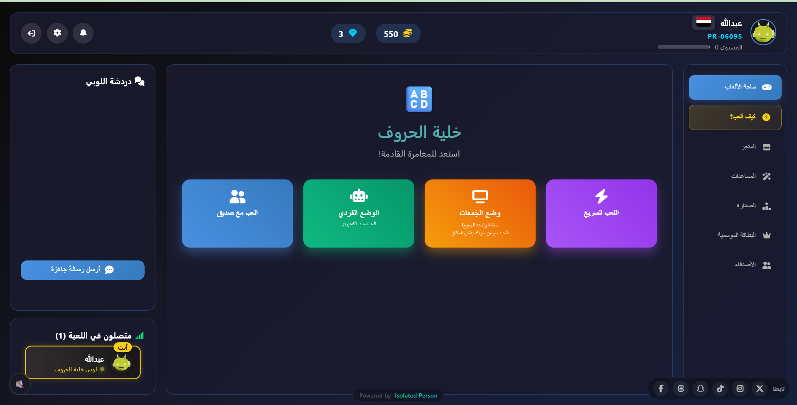
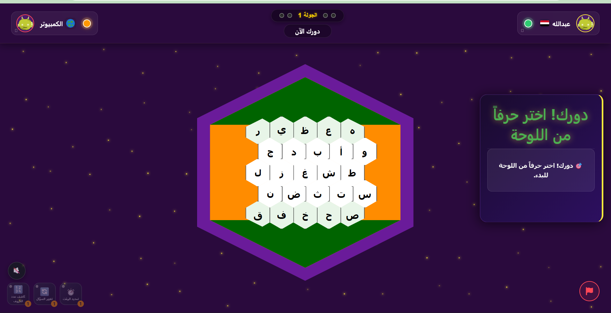
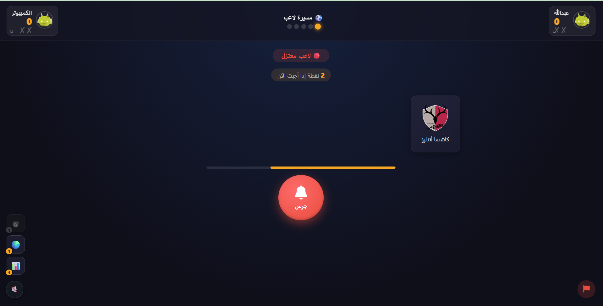
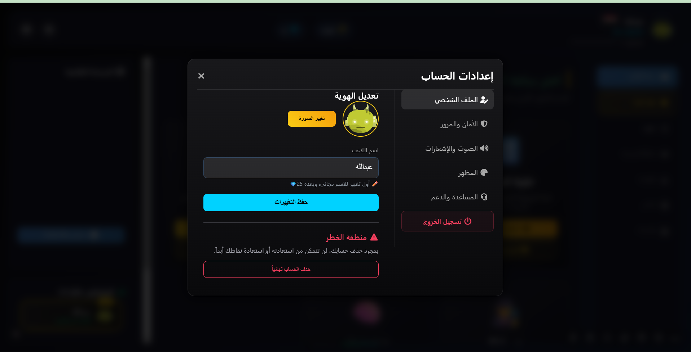
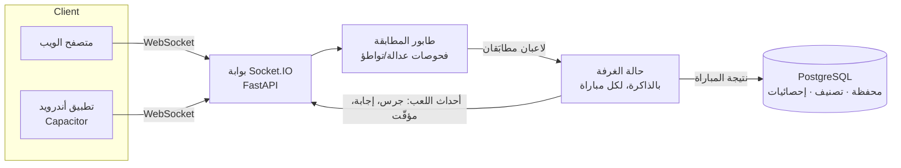

# PlayRush 🎮

منصة ألعاب جماعية لحظية (Real-time) بواجهة عربية أولاً — تحدَّ أصدقاءك أو لاعبين عشوائيين من حول
العالم في مجموعة ألعاب معلومات وذكاء، عبر الويب أو تطبيق أندرويد.

🔗 **جرّب اللعبة الآن**: [playrush.pages.dev](https://playrush.pages.dev) · 🇬🇧 [English](README.md)

> هذا المستودع للعرض فقط — يوثّق البنية والقرارات الهندسية. الكود المصدري الكامل يُدار بمستودع خاص.

---

## لقطات شاشة

<p align="center">
  
  
  
  
  
</p>

*(أضِف لقطات حقيقية بمجلد `screenshots/` — راجع الملاحظة بآخر الملف)*

## الألعاب

| اللعبة | الوصف |
|---|---|
| 🔤 **خلية الحروف** | لعبة سيطرة استراتيجية على لوحة سداسية — أجب صح لتسيطر على الخلية. |
| ⚽ **مسيرة لاعب** | خمّن اسم لاعب كرة قدم من خلال الأندية التي لعب لها بالترتيب. |
| 🏦 **بنك** | سلسلة إجابات متتالية — احفظ رصيدك بـ"بنك" قبل أن تخطئ وتخسر كل شيء. |
| 🎭 **من أنا** | خمّن الشخصية من تلميحات متتالية. |
| 🧠 **معلومات عامة** | أسئلة معلومات عامة كلاسيكية بنظام تنافسي. |

كل لعبة تدعم مباريات أونلاين حقيقية (عامة أو خاصة مع الأصدقاء)، ووضعاً فردياً ضد بوت بعدة مستويات
صعوبة.

## البنية التقنية



عملية FastAPI واحدة تخدم REST API وطبقة Socket.IO معاً. حالة المباراة (الدور، السؤال الحالي،
النقاط، المؤقّتات) تعيش بالذاكرة طوال المباراة — لا تلمس قاعدة البيانات إلا عند الانتهاء، وهذا
يخلّي المسار الحرج (كل جرس، كل إجابة) سريعاً. قاعدة البيانات ترى فقط النتيجة النهائية: تغيّر
التصنيف، تحديث المحفظة، سجل المباريات.

## ملاحظات هندسية: المشاكل المثيرة فعلاً

المشاكل الصعبة بمنصة ألعاب معلومات مو بالواجهة — هي بالأجزاء اللي فيها العميل ما تقدر تثق فيه،
والشبكة ما تقدر تثق فيها، والعملية ممكن تتعطّل بمنتصف مباراة.

### ١. الإجابة ما توصل للعميل إطلاقاً قبل وقتها

الطريقة الساذجة لبناء "أرسل سؤال للاعبين" هي تحط السؤال والإجابة بنفس البيانات، وبس ما *تعرض*
الإجابة بالواجهة إلا وقت الكشف. هذا مو أمان — أي حد يقدر يفتح تبويب Network بالمتصفح ويقرأ بيانات
الـWebSocket الخام.

القاعدة الفعلية المطبَّقة بكل لعبة: **الإجابة ما تغادر السيرفر إطلاقاً حتى تنتهي الجولة.** السيرفر
يحتفظ بالإجابة الصحيحة (والصيغ البديلة المقبولة) بحالة المباراة؛ العميل يستقبل فقط نص السؤال
والتصنيف والمؤقّت. لما اللاعب يرسل إجابته، السيرفر يقارنها بالإجابة المخزّنة — بمطابقة مرنة
للصيغ المختلفة، مع حكم ذكاء اصطناعي للحالات الحدّية بالإجابات الحرة — وبعدها بس تُرسل الإجابة
للعميل، كجزء من حدث النتيجة.

```python
# اللي يستقبله العميل عند بدء سؤال — بلا أي حقل إجابة إطلاقاً
{
  "question": "...",
  "category": "...",
  "timer": 40,
}

# بالسيرفر فقط، ما تُسلسل أبداً لبيانات socket:
# current_question["answer"], current_question["accepted_answers"]
```

يبدو بديهياً بعد ما تعرفه، لكنه يحتاج تطبيقاً صارماً بكل نقطة إرسال — بما فيها مسار إعادة
الاتصال، لما تُعاد بناء حالة اللاعب العائد من الصفر. نسيان نقطة واحدة يعيد فتح الثغرة؛ من النوع
اللي ما يظهر إلا لما حد يفتح أدوات المطوّر فعلياً بمنتصف مباراة.

### ٢. انقطع نت لاعب بمنتصف المباراة — وش يصير؟

الانقطاعات مو نادرة بقاعدة لاعبين أغلبها من الجوال. المنصة لازم تقرر خلال ثوانٍ: هل انقطاع
الاتصال "غياب لحظي" أو "انسحاب".

الأسلوب المتّبع: عند الانقطاع، تُعلَّم الغرفة ويُخبَر الخصم ("ننتظر عودته...")، وتبدأ مهلة زمنية.
لو رجع اتصال اللاعب قبل انتهاء المهلة، تُلغى المهلة وتكمل المباراة بالضبط من حيث توقّفت — السيرفر
يعيد إرسال حالة المباراة الحالية ليتزامن اللاعب العائد. لو انتهت المهلة أولاً، تُحتسب المباراة
انسحاباً: يفوز الخصم، وتُسجَّل النتيجة عبر نفس مسار المكافآت المستخدم بالفوز العادي، وتُحذف الغرفة.

```python
async def handle_disconnection_timeout(room_code, old_sid):
    await asyncio.sleep(GRACE_PERIOD_SECONDS)
    room = get_room_state(room_code)
    if room and still_missing(room, old_sid):
        award_forfeit_win(room, old_sid)
```

المهلة قصيرة بما يكفي حتى لا يبقى الخصم أمام شاشة متجمّدة لدقائق لو كان انسحاباً فعلياً، وطويلة
بما يكفي لتحمّل انقطاع حقيقي (نفق، مصعد، شبكة جوال متذبذبة) بلا معاقبة اللاعب ظلماً.

### ٣. عدالة المطابقة — التهديد مو بمستوى المهارة، هو التواطؤ

بمنصة فيها عملة داخل اللعبة وتصنيف مرتبط بنتائج المباريات، المشكلة المثيرة بالمطابقة مو "لاقِ لي
خصماً بنفس مستواي" — هي "تأكّد إن اللاعبين مو نفس الشخص، أو صديقين يزرعان مكافآت لبعض". الطابور
نفسه بسيط (أول متاح)؛ المنطق الحقيقي بشروط قبول أي إقران قبل تأكيده:

- مو نفس الحساب
- مو نفس عنوان IP
- مو زوج تطابق مؤخراً (فترة تهدئة)
- مو محظورين لبعض أو أصدقاء صراحة (تفادي نتائج متفَّق عليها مسبقاً)

أي إقران يفشل بأي من هذي الشروط يُتخطّى، والطابور يجرّب المرشّح التالي. يعمل بنفس الطريقة تماماً
سواء كانت المنصة على عملية واحدة أو موزّعة على عدة عمّال عبر Redis.

### ٤. مقايضة متعمَّدة: حالة المباراة بالذاكرة

حالة المباراة تعيش بذاكرة عملية واحدة، مو بـPostgreSQL أو Redis. هذي مقايضة بساطة متعمَّدة لحجم
المنصة الحالي، مو إغفالاً — كل محرّك لعبة أصلاً يطبّق دالتي `to_dict()`/`from_dict()` تحديداً حتى
تقدر حالة المباراة تُسلسل وتُنقل لـRedis بلا إعادة كتابة، أي وقت تحتاج المنصة مشاركة حالة عبر
عمّال متعددين بما يبرر التعقيد الإضافي. حالياً، لو أعيد تشغيل العملية، تُفقد المباريات الجارية
ويعيد اللاعبون المطابقة — تكلفة مقبولة بالحجم الحالي، مع مسار الترقية جاهز التصميم مسبقاً.

## التقنيات

- **الباك اند**: FastAPI + Socket.IO (Python)، PostgreSQL، Redis (اختياري للتوسّع متعدد العمّال)
- **الفرونت اند**: HTML/CSS/JS ثابت — بلا إطار عمل، بلا أداة بناء
- **الجوال**: نفس الفرونت اند مُغلَّف لأندرويد عبر Capacitor
- **الذكاء الاصطناعي**: حكم LLM لتقييم الإجابات الحرة بالحالات الحدّية

## صيانة هذا العرض

لإضافة لقطات شاشة حقيقية: حط ملفات PNG بمجلد `screenshots/` بأسماء `main_lobby.png`، `lobby.png`،
`huroof.png`، `career.png`، `profile.png` (أو عدّل وسوم `` أعلاه حسب اللي تضيفه).

## تواصل

للاستفسارات أو الملاحظات: افتح Issue بهذا المستودع.
