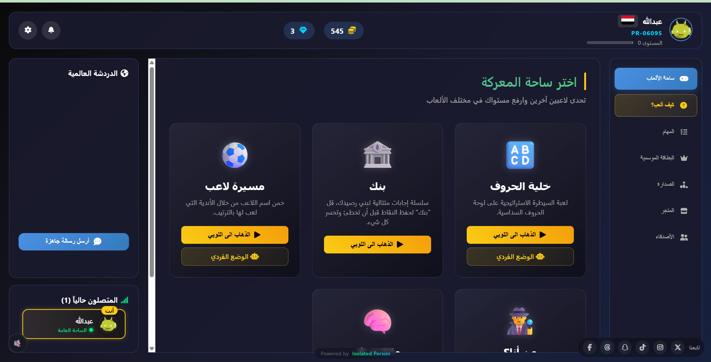
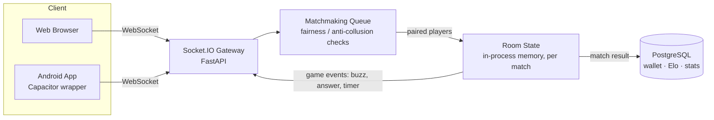

<!-- Title: PlayRush -->

# PlayRush 🎮

A real-time multiplayer trivia/party-game platform with an Arabic-first UI — challenge friends
or random opponents across a set of quiz-style games, on the web or a native Android app.

🔗 **Live**: [playrush.pages.dev](https://playrush.pages.dev) · 🇸🇦 [النسخة العربية](README.ar.md)

> This repository is a showcase — it documents the architecture and engineering decisions.
> The full source is maintained in a private repository.

---

## Screenshots

<p align="center">
  
  
  
  
  
</p>

*(add real screenshots to `screenshots/` — see the maintenance note at the bottom)*

## Games

| Game | Description |
|---|---|
| 🔤 **Huroof** (خلية الحروف) | Hex-board control game — buzz in and answer correctly to claim a cell. |
| ⚽ **Career** (مسيرة لاعب) | Guess a footballer from the clubs he played for, revealed one at a time. |
| 🏦 **Bank** | Chain of consecutive correct answers — "bank" your points before you get one wrong and lose them all. |
| 🎭 **Who Am I** (من أنا) | Guess the character from progressive clues. |
| 🧠 **Knowledge** (معلومات عامة) | Classic competitive trivia. |

Every game supports real online matches (public or private with friends) and a solo mode against
a bot with several difficulty levels.

## Architecture



One FastAPI process serves both the REST API and the Socket.IO layer. Match state (whose turn,
current question, scores, timers) lives in memory for the lifetime of a match — it never touches
the database until the match ends, which keeps the hot path (every buzz, every answer) fast. The
database only sees the final result: rating changes, wallet updates, match history.

## Engineering notes: the interesting problems

A trivia platform's hard problems aren't the UI — they're the parts where the client can't be
trusted, the network can't be trusted, and the process can crash mid-match.

### 1. Never let the client see the answer

The obvious way to build a "send a question to two players" flow is to put the question and the
answer in the same payload, and just not *render* the answer client-side until it's revealed.
That's not security — anyone can open the browser's Network tab and read the raw WebSocket frame.

The actual rule enforced across every game: **the answer never leaves the server until the round
is over.** The server holds the correct answer (and accepted alternate spellings) in the match
state; the client only ever receives the question text, category, and timer. When a player
submits an answer, the server compares it against the stored answer — using fuzzy matching for
spelling variants, and falling back to an AI judge for free-text edge cases — and only *then*
does the answer get sent to clients, as part of the result event.

```python
# what the client receives when a question starts — no answer field at all
{
  "question": "...",
  "category": "...",
  "timer": 40,
}

# server-side only, never serialized to a socket payload:
# current_question["answer"], current_question["accepted_answers"]
```

This sounds obvious in hindsight, but it has to be enforced at *every* emission point — including
the reconnect path, where a returning player's client state gets rebuilt from scratch. Missing
even one of those paths reopens the hole; it's the kind of bug that's invisible until someone
actually opens devtools mid-match.

### 2. A player's internet drops mid-match — what happens?

Disconnects are not rare in a mobile-heavy player base. The platform has to decide, within
seconds, whether to treat a dropped socket as "stepped away for a second" or "gave up."

The approach: on disconnect, the room is flagged and the opponent is notified ("waiting for
reconnect..."), and a grace-period timer starts. If the player's client re-establishes a session
before the timer fires, the timer is cancelled and the match resumes exactly where it left off —
the server re-sends the current match state to resync the returning client's UI. If the timer
fires first, the match is scored as a forfeit: the opponent wins, the result is recorded through
the same reward pipeline as a normal win, and the room is torn down.

```python
async def handle_disconnection_timeout(room_code, old_sid):
    await asyncio.sleep(GRACE_PERIOD_SECONDS)
    room = get_room_state(room_code)
    if room and still_missing(room, old_sid):
        award_forfeit_win(room, old_sid)
```

The grace period is short enough that a genuine leaver doesn't leave their opponent staring at a
frozen screen for minutes, but long enough to survive a real dropped connection (a tunnel, an
elevator, a flaky mobile network) without unfairly punishing the player.

### 3. Matchmaking fairness — the threat isn't skill, it's collusion

For a platform with in-game currency and rankings tied to match outcomes, the interesting
matchmaking problem isn't "find someone my skill level" — it's "make sure two players aren't the
same person, or friends farming each other for rewards." The queue itself is a simple
first-available match; the real logic is in what makes a pairing *valid* before it's confirmed:

- not the same account
- not the same IP address
- not a pair that was already matched together recently (cooldown)
- not already blocked or explicitly friended (to avoid pre-arranged outcomes)

A candidate pairing that fails any of those checks is skipped, and the queue looks at the next
candidate instead. This runs identically whether the platform is on a single process or scaled
across multiple workers behind Redis.

### 4. Trade-off, made deliberately: in-memory match state

Match state lives in a single process's memory, not in Postgres or Redis. That's a deliberate
simplicity trade-off for the platform's current scale, not an oversight — every game engine
already implements a `to_dict()`/`from_dict()` pair specifically so match state *can* be
serialized and handed to Redis without a rewrite, whenever the platform needs multi-worker
match-state sharing badly enough to justify the added complexity. Today, if the process restarts,
in-flight matches are lost and players re-queue — an accepted cost at the current scale, with the
migration path already designed in.

## Stack

- **Backend**: FastAPI + Socket.IO (Python), PostgreSQL, Redis (optional, for multi-worker scaling)
- **Frontend**: vanilla HTML/CSS/JS — no framework, no build step
- **Mobile**: the same frontend wrapped for Android via Capacitor
- **AI**: an LLM judge for free-text answer grading on edge cases

## Maintaining this showcase

To add real screenshots: drop PNGs into `screenshots/` named `main_lobb.png`, `lobby.png`,
`huroof.png`, `career.png`, `profile.png` (or edit the `` tags above to match whatever you add).

## Contact

Questions or feedback: open an Issue on this repository.
